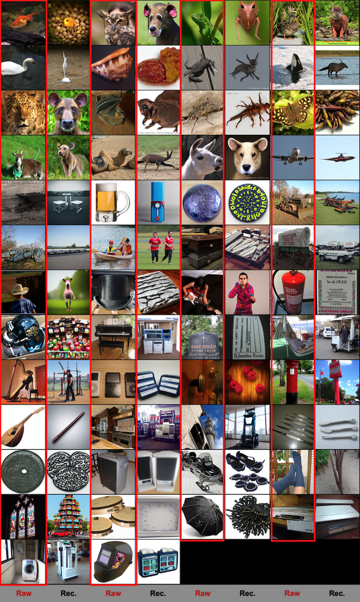

# Demo for GESS


## **Alleviating the Semantic Gap for Generalized fMRI-to-Image Reconstruction**


## Install required packages
To run the GESS model, you need to install the required packages. First, we create a conda environment and install the necessary packages for the latent diffusion model:

```
conda env create -f environment.yaml
conda activate ldm

pip install transformers==4.19.2 scann kornia==0.6.4 torchmetrics==0.6.0
pip install git+https://github.com/arogozhnikov/einops.git
```
Due to time constraints, we provide a few examples of our preprocessed structural features (pre-extracted by CycleGAN [3]) and semantic features for demonstrating the component substitution method used in the paper. We are working on organizing the complete code.

## Run Latent Diffusion Models

To run this demo, you need to download the pretrained diffusion model[1] for 768x768 resolution from the following link:

https://ommer-lab.com/files/rdm/model.ckpt

Save the downloaded file in the "./all_data/" directory. Then, run the following command:

python god_gen.py -sub 3

The generated results are saved in the "./outputs/" folder. Here is an example of the results for subject 3:


The model runs on a single GPU (NVIDIA GeForce RTX 3090) and approximately 7 ddim sampling steps are performed every second. We would like to thank the authors of the RDM code [2], as our project is based on it.

## Reference:

[1] Blattmann A, Rombach R, Oktay K, et al. Semi-Parametric Neural Image Synthesis[C]//Advances in Neural Information Processing Systems. 2022.

[2] Rombach R, Blattmann A, Lorenz D, et al. High-resolution image synthesis with latent diffusion models[C]//Proceedings of the IEEE/CVF Conference on Computer Vision and Pattern Recognition. 2022: 10684-10695.

[3] Beliy R, Gaziv G, Hoogi A, et al. From voxels to pixels and back: Self-supervision in natural-image reconstruction from fMRI[J]. Advances in Neural Information Processing Systems, 2019, 32.
